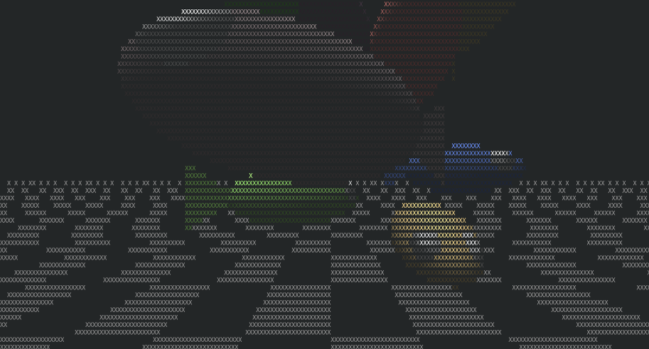
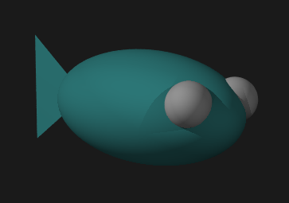

# Fishies

A terminal-based 3D fish animation written in Go.

## Usage

Run the program specifying the number of fish and whether to show the ground plane:

```bash
go run . -f 10 -g
```
Looks like this:



Help page:
```bash
$ go run . --help
Usage: /tmp/go-build1423219265/b001/exe/fishies [options]

Options:
  -f int
        shorthand for --fish (default 3)
  -fish int
        number of fish to simulate (default 3)
  -g    shorthand for --ground
  -ground
        enable ground plane
```

## How it was created

This project started as a POV-Ray scene description that rendered fish in 3D. Here's the original POV-Ray rendering:



The POV-Ray scene was rendered using:
```bash
povray +W800 +H600 +A Output_File_Name=fish.png fish.pov && display fish.png
```

Then I used Claude AI to convert the POV-Ray file to fish.go, and to create most of the rest of the code.
